

  
  <h1>
    Sparkles v1.0.8 👋
  </h1>

**引言**

**Sparkles**是一个专业的 HarmonyOS 设备 UI 自动化测试工具，采用 Electron + React + TypeScript 技术栈构建，提供完整的自动化测试解决方案。项目名称寓意"闪耀的测试工具"，旨在为 HarmonyOS 应用测试带来高效、智能的测试体验。项目采用模块化架构，集成了工作流引擎、测试计划管理、屏幕镜像等核心功能，为鸿蒙测试工程师提供了一站式的自动化测试解决方案。

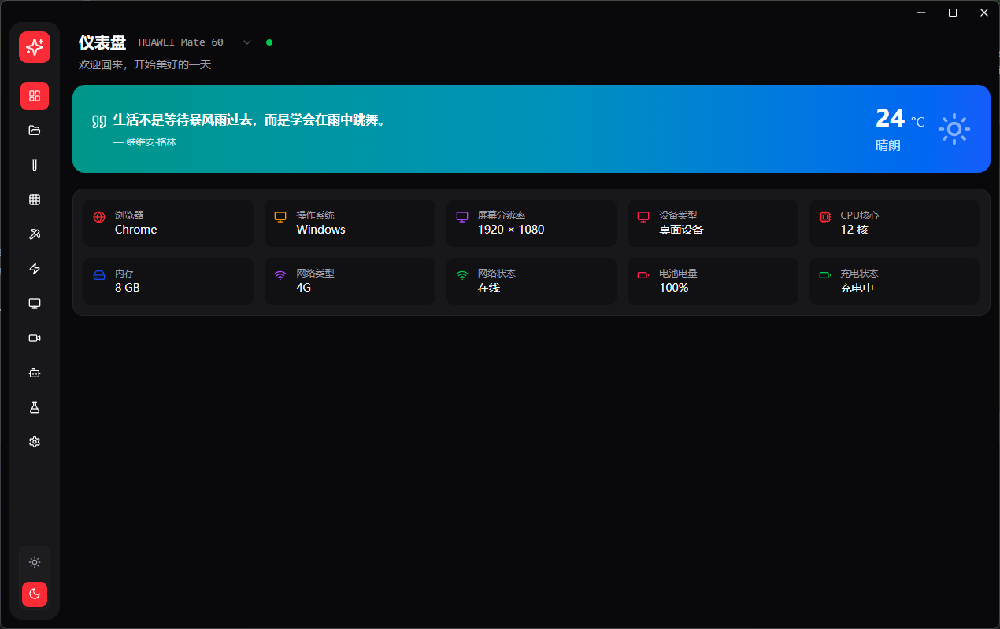
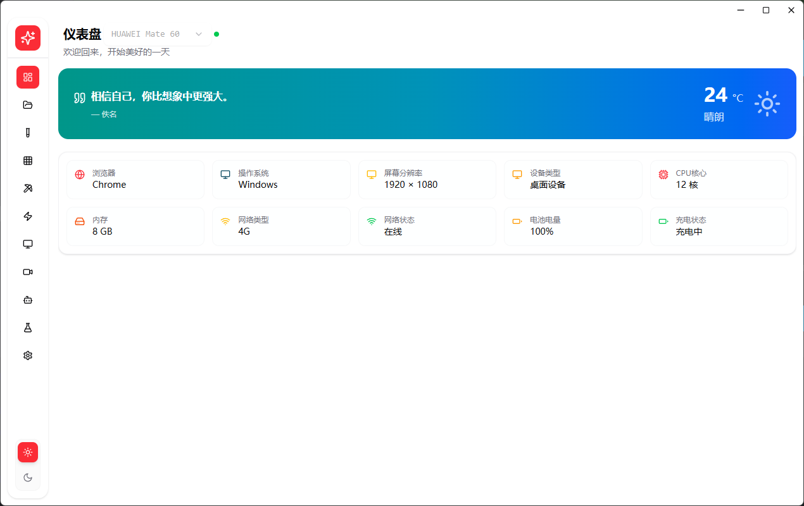

**核心功能模块**

**v1.0.8**

**更新**

- 实现性能监控任务

- wukong执行
- 便捷二维码（用于设备数据传输）
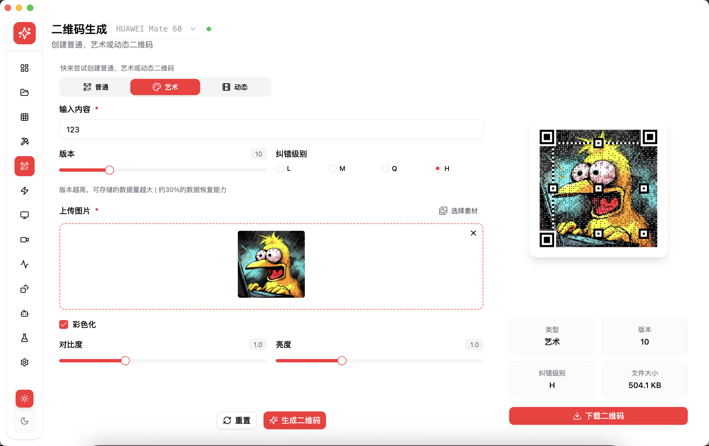

**重构**

- 智能用例生成
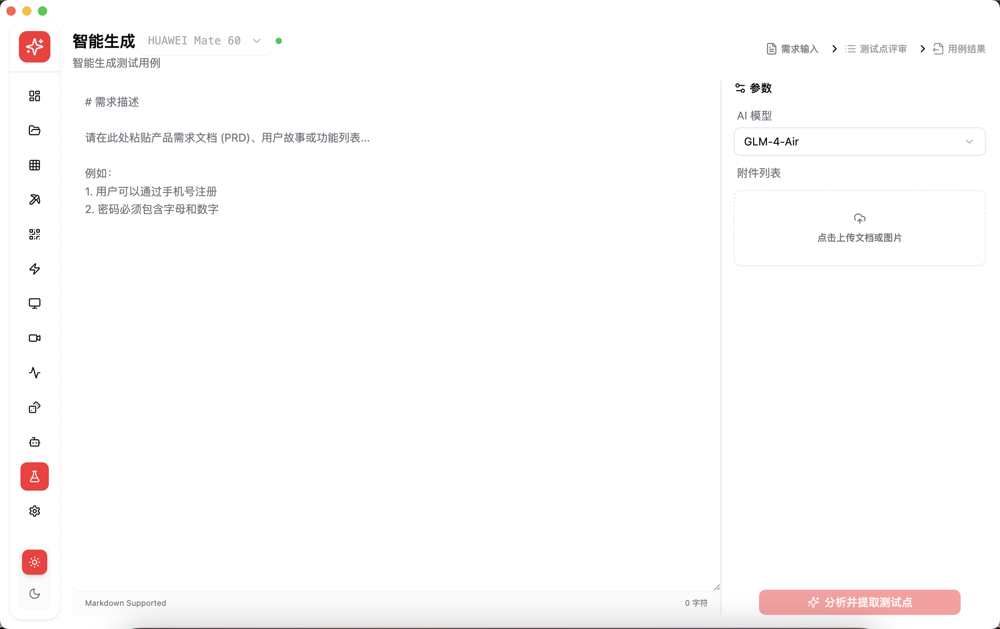
- 工具栏
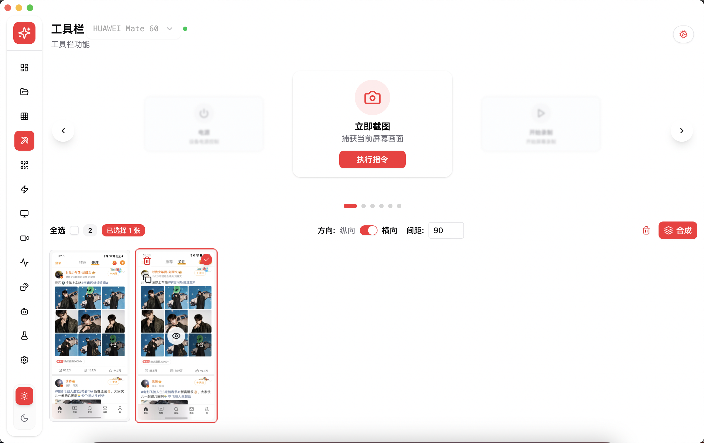

**1. 工作流引擎**

**功能特性:**

- 可视化工作流设计器，支持拖拽式节点编排
- 丰富的节点类型：点击、输入、等待、条件判断、循环等
- 实时执行监控和调试功能

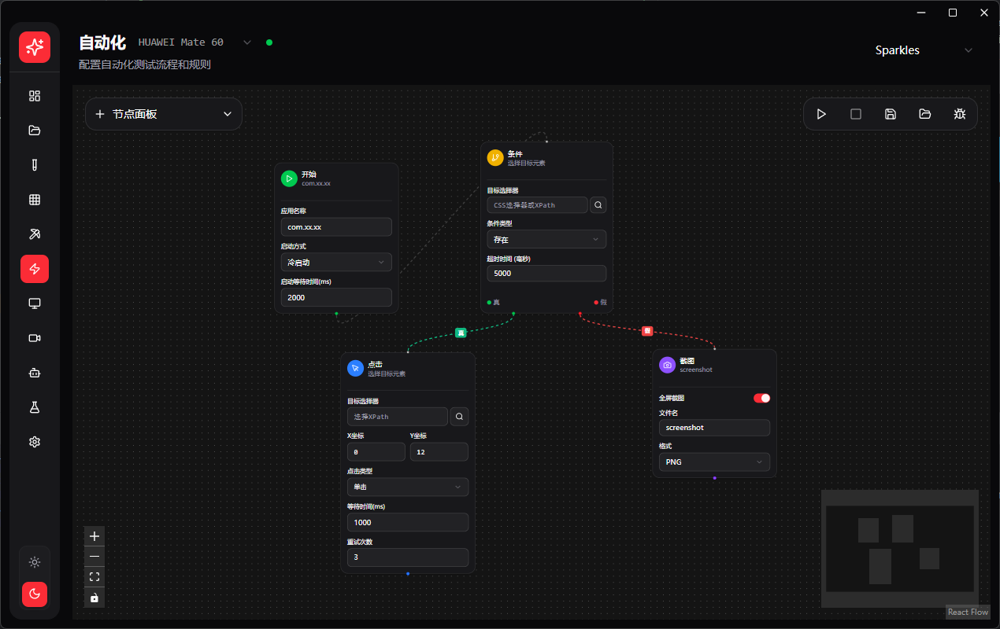

**2. 设备连接与屏幕镜像**

**技术亮点:**

- 集成HDCKit实现鸿蒙设备连接
- 实时屏幕镜像
- 支持多设备切换重连
- 应用管理
- 常用操作工具栏

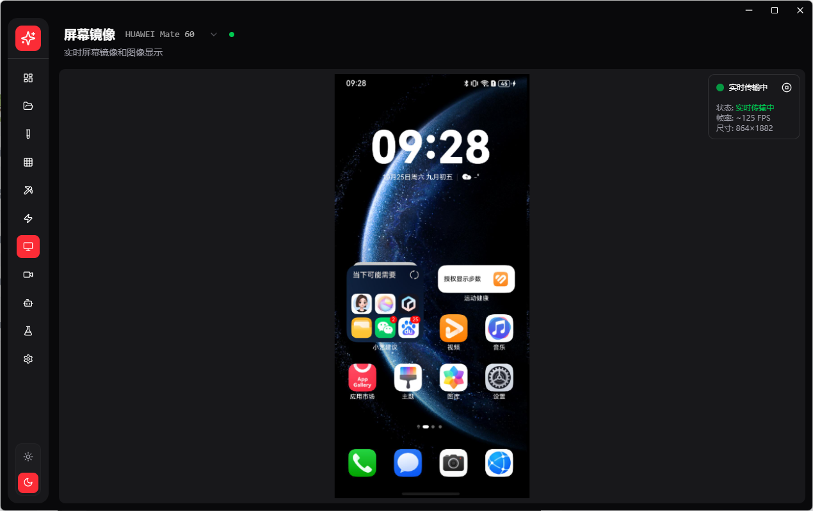
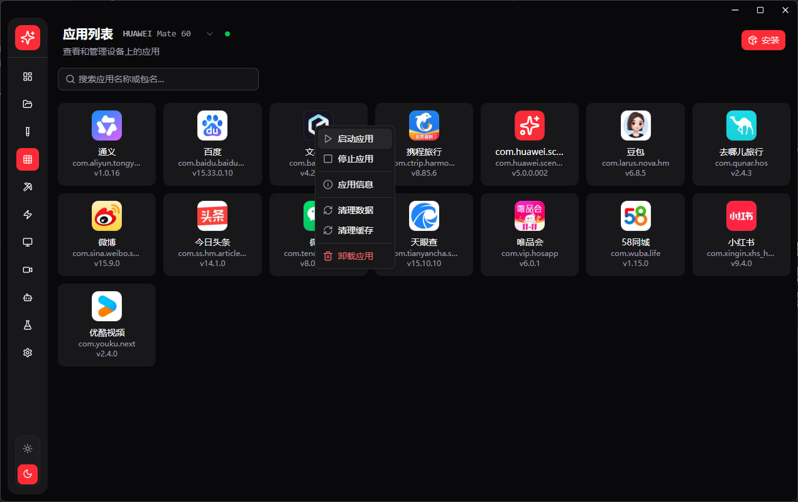
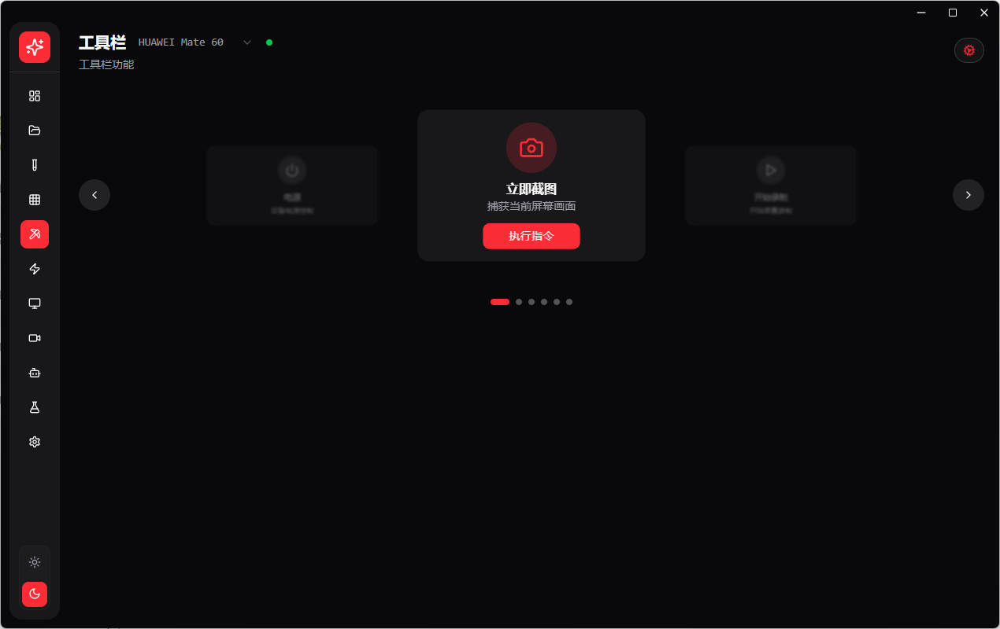

**3. AI智能助手**

**创新功能:**

- 集成智谱AI大模型
- 智能测试用例生成
- 测试优化建议
- 自然语言交互界面

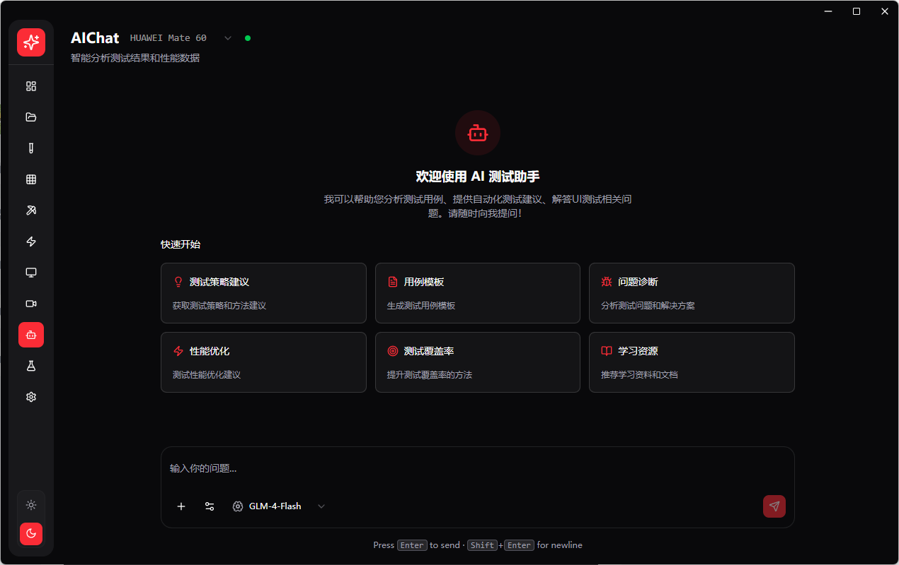
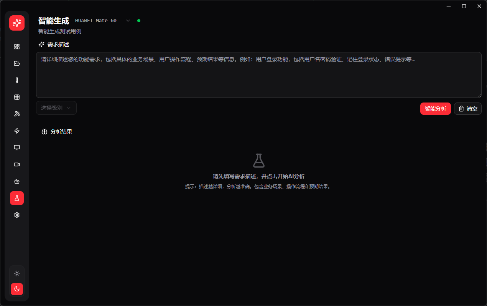

**4. 项目与测试用例**

**更新开发中...**

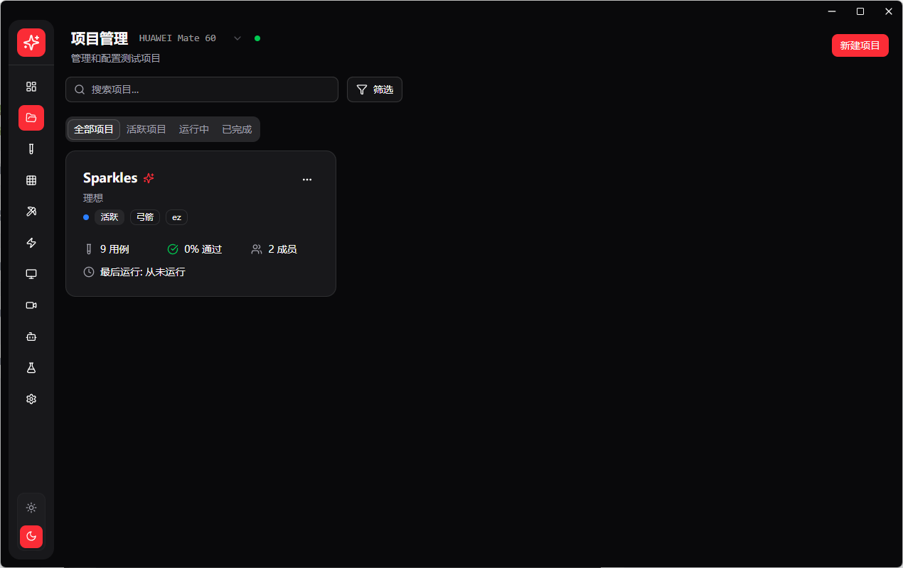
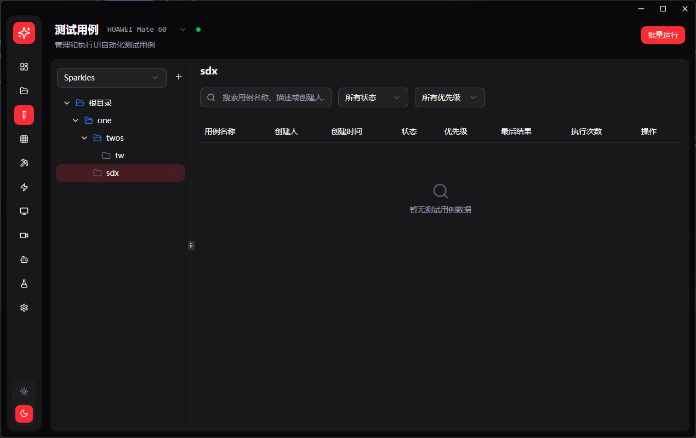

**结语**

**Sparkles** 不仅仅是一个测试工具，更是我们对自动化测试未来的探索。通过技术创新和持续优化，我们相信 Sparkles 能够为 HarmonyOS 生态的繁荣发展贡献力量。
