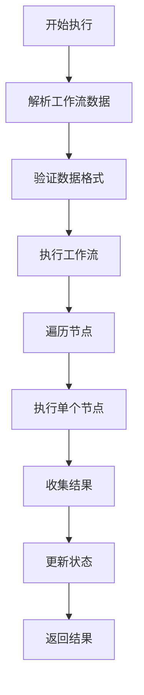
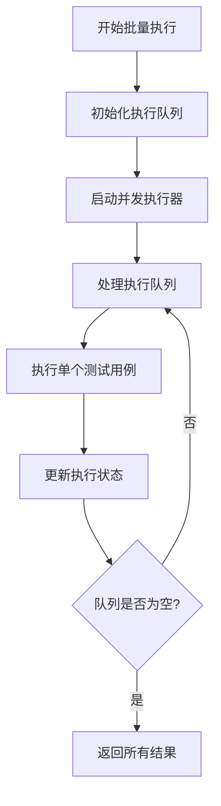

# 测试用例执行引擎重构文档

## 📋 概述

本文档描述了测试用例执行系统的重构，从依赖 `MainWorkflowExecutor` 的架构改为独立的 `TestExecutionEngine`，支持单个和批量执行，并为后续扩展提供了良好的基础。

## 🎯 重构目标

1. **独立性**: 测试用例执行不依赖工作流执行器
2. **可扩展性**: 支持单个和批量执行
3. **并发控制**: 支持并发执行多个测试用例
4. **状态管理**: 独立的执行状态跟踪
5. **兼容性**: 保持现有API接口不变

## 🏗️ 新架构设计

### 核心组件

#### 1. TestExecutionEngine (测试执行引擎)

**文件**: `src/main/test-execution-engine.ts`

**职责**:
- 管理测试用例执行生命周期
- 处理单个和批量执行
- 控制并发执行数量
- 跟踪执行状态和结果

**主要方法**:
```typescript
class TestExecutionEngine {
  // 执行单个测试用例
  async executeSingleTestCase(testCase: any, options: TestExecutionOptions): Promise<TestCaseExecutionResult>
  
  // 批量执行测试用例
  async executeBatchTestCases(testCases: any[], options: TestExecutionOptions): Promise<Map<string, TestCaseExecutionResult>>
  
  // 获取执行状态
  getStatus(): TestExecutionStatus
  
  // 停止执行
  stopExecution(): void
}
```

#### 2. 执行状态管理

**状态接口**:
```typescript
interface TestExecutionStatus {
  isRunning: boolean;                    // 是否正在执行
  currentTestCaseId: string | null;     // 当前执行的测试用例ID
  completedCount: number;               // 已完成数量
  totalCount: number;                   // 总数量
  results: Map<string, TestCaseExecutionResult>; // 执行结果
  errors: Map<string, Error>;           // 错误信息
}
```

#### 3. 节点执行逻辑

**独立实现**: 不依赖 `MainWorkflowExecutor`，直接实现节点执行逻辑

**支持的节点类型**:
- `start`: 开始节点
- `click`: 点击节点
- `print`: 输入节点
- `wait`: 等待节点
- `screenshot`: 截图节点

## 🔧 实现细节

### 1. 单个测试用例执行流程



### 2. 批量执行流程



### 3. 并发控制

**特性**:
- 可配置最大并发数 (`maxConcurrent`)
- 队列管理机制
- 状态同步和错误处理

**实现**:
```typescript
// 并发执行器
private async processExecutionQueue(testCases: any[], options: TestExecutionOptions): Promise<void> {
  while (this.executionQueue.length > 0 || this.runningTests.size > 0) {
    // 处理队列中的测试用例
    // 控制并发数量
    // 更新执行状态
  }
}
```

## 📁 文件结构

```
src/main/
├── test-execution-engine.ts    # 新的执行引擎
├── handlers.ts                 # 更新的IPC处理器
└── test-case-executor.ts       # 已删除的旧文件

src/renderer/src/components/test-cases/
└── test-case-list.tsx          # 更新的UI组件

src/preload/
├── index.ts                    # 更新的API接口
└── index.d.ts                  # 更新的类型定义
```

## 🔄 API 接口更新

### 新增接口

#### 1. 批量执行测试用例

**IPC Handler**: `execute-batch-test-cases`

**参数**:
- `testCases`: 测试用例数组
- `connectKey`: 设备连接键
- `options`: 执行选项

**返回**:
```typescript
{
  success: boolean;
  data?: {
    results: Record<string, TestCaseExecutionResult>;
    summary: {
      total: number;
      success: number;
      failed: number;
    };
  };
  error?: string;
}
```

#### 2. 执行选项

```typescript
interface TestExecutionOptions {
  deviceConnectKey: string;
  timeout?: number;           // 超时时间
  maxConcurrent?: number;     // 最大并发数
  onProgress?: (testCaseId: string, progress: number) => void;
  onTestCaseComplete?: (testCaseId: string, result: TestCaseExecutionResult) => void;
  onError?: (testCaseId: string, error: Error) => void;
}
```

## 🎨 UI 更新

### 1. 批量选择功能

**新增控件**:
- 全选/取消全选复选框
- 每行测试用例的选择复选框
- 批量执行按钮

**状态管理**:
```typescript
const [selectedTestCases, setSelectedTestCases] = useState<string[]>([]);
const [isBatchExecuting, setIsBatchExecuting] = useState(false);
```

### 2. 批量执行按钮

**显示条件**: 当有选中的测试用例时显示

**功能**:
- 显示选中数量
- 执行状态指示
- 禁用状态管理

## 🚀 使用示例

### 1. 单个测试用例执行

```typescript
// 在渲染进程中
const response = await window.api.executeTestCase(testCase, connectKey);
if (response.success) {
  console.log('执行结果:', response.data);
}
```

### 2. 批量测试用例执行

```typescript
// 在渲染进程中
const response = await window.api.executeBatchTestCases(
  testCases,
  connectKey,
  {
    maxConcurrent: 2,
    timeout: 60000
  }
);

if (response.success) {
  console.log('批量执行结果:', response.data.summary);
}
```

## 🔍 调试和监控

### 1. 日志记录

**执行引擎日志**:
- 测试用例开始/完成
- 节点执行状态
- 错误信息记录

**UI状态日志**:
- 选择状态变化
- 执行进度更新
- 结果状态同步

### 2. 状态监控

**实时状态**:
- 当前执行的测试用例
- 完成进度
- 错误统计

## 🎯 优势

### 1. 架构优势

- **独立性**: 不依赖工作流执行器，减少耦合
- **可扩展性**: 易于添加新的执行策略
- **可维护性**: 清晰的职责分离

### 2. 功能优势

- **批量执行**: 支持同时执行多个测试用例
- **并发控制**: 可配置的并发执行数量
- **状态管理**: 完整的执行状态跟踪

### 3. 用户体验

- **直观操作**: 简单的选择和执行操作
- **实时反馈**: 执行状态和进度显示
- **错误处理**: 完善的错误提示和处理

## 🔮 后续扩展

### 1. 执行策略

- 顺序执行模式
- 并行执行模式
- 条件执行模式

### 2. 结果分析

- 执行报告生成
- 性能指标统计
- 趋势分析

### 3. 集成功能

- 与CI/CD集成
- 测试报告导出
- 通知系统集成

## 📝 总结

通过这次重构，我们实现了：

1. ✅ **独立的测试执行引擎** - 不依赖工作流执行器
2. ✅ **批量执行支持** - 可同时执行多个测试用例
3. ✅ **并发控制** - 可配置的并发执行数量
4. ✅ **状态管理** - 完整的执行状态跟踪
5. ✅ **UI增强** - 直观的批量操作界面
6. ✅ **API兼容** - 保持现有接口不变

新的架构为测试用例执行提供了更强大、更灵活的功能，同时为后续的功能扩展奠定了良好的基础。
