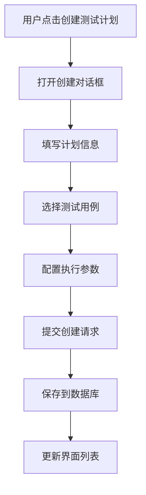
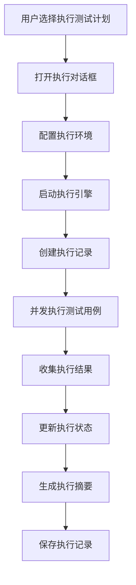
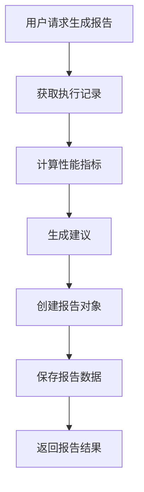

# 测试计划架构重构文档

## 📋 概述

本文档描述了测试计划架构的重构，从测试用例页面的批量执行逻辑改为独立的测试计划页面，实现了完整的测试计划管理、执行和报告功能。

## 🎯 重构目标

1. **职责分离**: 测试用例页面专注于单个用例管理，测试计划页面负责批量执行
2. **功能完整**: 提供完整的测试计划生命周期管理
3. **用户体验**: 直观的测试计划创建、执行和监控界面
4. **可扩展性**: 为后续功能扩展提供良好的基础架构

## 🏗️ 新架构设计

### 核心组件

#### 1. 数据模型层

**文件**: `src/types/test-plan.ts`

**主要接口**:
- `TestPlan`: 测试计划基础信息
- `TestPlanExecution`: 测试计划执行记录
- `TestReport`: 测试报告
- `TestCaseExecutionResult`: 测试用例执行结果
- `TestPlanExecutionSummary`: 执行摘要统计

#### 2. 执行引擎层

**文件**: `src/main/test-plan-execution-engine.ts`

**职责**:
- 管理测试计划的执行生命周期
- 处理并发执行控制
- 跟踪执行状态和进度
- 生成执行日志和结果

**核心方法**:
```typescript
class TestPlanExecutionEngine {
  // 执行测试计划
  async executeTestPlan(testPlan: TestPlan, options: TestPlanExecutionOptions): Promise<TestPlanExecution>
  
  // 获取执行状态
  getExecution(executionId: string): TestPlanExecution | undefined
  
  // 停止执行
  stopExecution(executionId: string): boolean
}
```

#### 3. 管理层

**文件**: `src/main/test-plan-manager.ts`

**职责**:
- 测试计划的CRUD操作
- 执行历史管理
- 测试报告生成
- 数据持久化

**核心方法**:
```typescript
class TestPlanManager {
  // 创建测试计划
  async createTestPlan(request: CreateTestPlanRequest): Promise<TestPlan>
  
  // 执行测试计划
  async executeTestPlan(request: ExecuteTestPlanRequest): Promise<TestPlanExecution>
  
  // 生成测试报告
  async generateTestReport(executionId: string): Promise<TestReport>
}
```

#### 4. 界面层

**文件**: `src/renderer/src/components/TestPlan.tsx`

**功能模块**:
- 测试计划列表管理
- 执行历史查看
- 测试报告展示
- 创建和执行对话框

## 🔧 实现细节

### 1. 测试计划创建流程



### 2. 测试计划执行流程



### 3. 测试报告生成流程



## 📁 文件结构

```
src/
├── types/
│   └── test-plan.ts                    # 测试计划类型定义
├── main/
│   ├── test-plan-execution-engine.ts   # 执行引擎
│   ├── test-plan-manager.ts            # 管理器
│   └── handlers.ts                     # IPC处理器
├── preload/
│   ├── index.ts                        # API接口
│   └── index.d.ts                      # 类型定义
└── renderer/src/components/
    ├── TestPlan.tsx                    # 测试计划页面
    ├── test-cases/
    │   └── test-case-list.tsx          # 移除批量执行逻辑
    ├── App.tsx                         # 添加路由
    └── sidebar.tsx                     # 添加导航
```

## 🔄 API 接口

### 测试计划管理

#### 创建测试计划
```typescript
createTestPlan(request: CreateTestPlanRequest): Promise<{ success: boolean; data?: TestPlan; error?: string }>
```

#### 更新测试计划
```typescript
updateTestPlan(request: UpdateTestPlanRequest): Promise<{ success: boolean; data?: TestPlan; error?: string }>
```

#### 删除测试计划
```typescript
deleteTestPlan(testPlanId: string): Promise<{ success: boolean; data?: any; error?: string }>
```

#### 获取测试计划列表
```typescript
getTestPlans(projectId?: string): Promise<{ success: boolean; data?: TestPlan[]; error?: string }>
```

### 执行管理

#### 执行测试计划
```typescript
executeTestPlan(request: ExecuteTestPlanRequest): Promise<{ success: boolean; data?: TestPlanExecution; error?: string }>
```

#### 获取执行历史
```typescript
getTestPlanExecutions(testPlanId?: string): Promise<{ success: boolean; data?: TestPlanExecution[]; error?: string }>
```

### 报告管理

#### 生成测试报告
```typescript
generateTestReport(executionId: string): Promise<{ success: boolean; data?: TestReport; error?: string }>
```

#### 获取测试报告列表
```typescript
getTestReports(executionId?: string): Promise<{ success: boolean; data?: TestReport[]; error?: string }>
```

## 🎨 用户界面

### 1. 测试计划列表

**功能特性**:
- 卡片式布局展示测试计划
- 状态徽章显示计划状态
- 操作菜单支持执行、编辑、删除
- 执行次数和最后执行时间显示

### 2. 执行历史

**功能特性**:
- 表格形式展示执行记录
- 状态徽章显示执行状态
- 成功率统计显示
- 一键生成测试报告

### 3. 测试报告

**功能特性**:
- 报告列表管理
- 报告类型标识
- 生成时间显示
- 报告查看功能

### 4. 创建/执行对话框

**功能特性**:
- 表单验证
- 配置参数设置
- 环境选择
- 并发控制配置

## 🚀 使用示例

### 1. 创建测试计划

```typescript
const testPlan = await window.api.createTestPlan({
  name: "登录功能测试计划",
  description: "测试用户登录相关功能",
  projectId: "project1",
  testCaseIds: ["tc1", "tc2", "tc3"],
  executionConfig: {
    maxConcurrent: 2,
    timeout: 30000,
    retryCount: 3,
    stopOnFailure: false,
    environment: "test",
  },
});
```

### 2. 执行测试计划

```typescript
const execution = await window.api.executeTestPlan({
  testPlanId: "tp_123",
  environment: "test",
  executionConfig: {
    maxConcurrent: 3,
    timeout: 60000,
  },
});
```

### 3. 生成测试报告

```typescript
const report = await window.api.generateTestReport("exec_456");
```

## 🔍 监控和调试

### 1. 执行状态监控

**实时更新**:
- 执行进度百分比
- 当前执行的测试用例
- 成功/失败统计
- 执行日志记录

### 2. 错误处理

**错误类型**:
- 测试计划不存在
- 执行环境配置错误
- 测试用例执行失败
- 系统资源不足

### 3. 日志记录

**日志级别**:
- `debug`: 详细调试信息
- `info`: 一般信息记录
- `warn`: 警告信息
- `error`: 错误信息

## 🎯 优势

### 1. 架构优势

- **职责清晰**: 测试用例和测试计划功能分离
- **可维护性**: 模块化设计，易于维护和扩展
- **可测试性**: 独立的组件便于单元测试

### 2. 功能优势

- **完整生命周期**: 从创建到执行到报告的全流程管理
- **并发控制**: 可配置的并发执行数量
- **状态跟踪**: 详细的执行状态和进度监控

### 3. 用户体验

- **直观操作**: 简单的创建和执行操作
- **实时反馈**: 执行状态和进度的实时更新
- **丰富信息**: 详细的执行历史和报告数据

## 🔮 后续扩展

### 1. 高级功能

- 测试计划模板
- 定时执行调度
- 条件执行逻辑
- 测试数据管理

### 2. 集成功能

- CI/CD集成
- 通知系统
- 数据导出
- 第三方工具集成

### 3. 分析功能

- 趋势分析
- 性能对比
- 失败原因分析
- 优化建议

## 📝 总结

通过这次重构，我们实现了：

1. ✅ **职责分离** - 测试用例和测试计划功能完全分离
2. ✅ **完整功能** - 提供测试计划的完整生命周期管理
3. ✅ **用户友好** - 直观的界面和操作流程
4. ✅ **可扩展性** - 为后续功能扩展提供良好基础
5. ✅ **监控完善** - 详细的执行状态和报告功能

新的测试计划架构为批量测试执行提供了专业、完整的解决方案，同时保持了良好的用户体验和系统可维护性。
